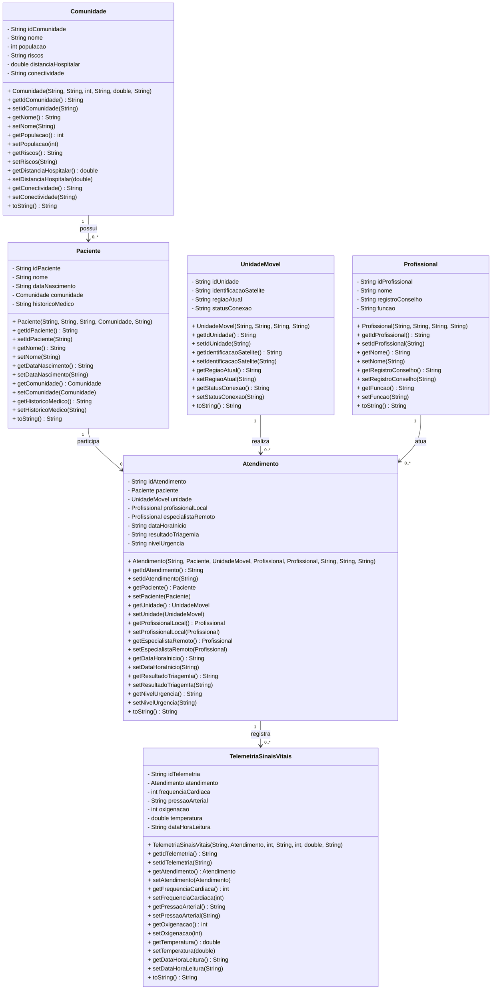

# ORBITCARE

Plataforma para atendimento médico remoto em comunidades isoladas.

Projeto Java desenvolvido para simular um sistema de atendimento em saúde utilizando Programação Orientada a Objetos.

## Funcionalidades

Cadastro e listagem de comunidades.

Cadastro, listagem, busca e atualização de pacientes.

Cadastro e listagem de unidades móveis.

Cadastro e listagem de profissionais de saúde.

Registro e listagem de atendimentos.

Registro e listagem de sinais vitais.

Geração automática de identificadores para comunidades, pacientes, unidades móveis, profissionais, atendimentos e sinais vitais.

Visualização organizada dos dados no console.

## Diagrama UML de Classes



## Modelo de Orientação a Objetos

O projeto utiliza objetos para representar os relacionamentos entre as classes.

Um paciente possui uma comunidade.

Um atendimento possui um paciente, uma unidade móvel, um profissional local e, opcionalmente, um especialista remoto.

Um registro de sinais vitais possui um atendimento.

Essa estrutura permite que uma classe acesse diretamente as informações relacionadas, sem depender apenas de identificadores soltos.

## Organização do Projeto

```text
src
  Main.java
  model
    Atendimento.java
    Comunidade.java
    Paciente.java
    Profissional.java
    TelemetriaSinaisVitais.java
    UnidadeMovel.java
```
