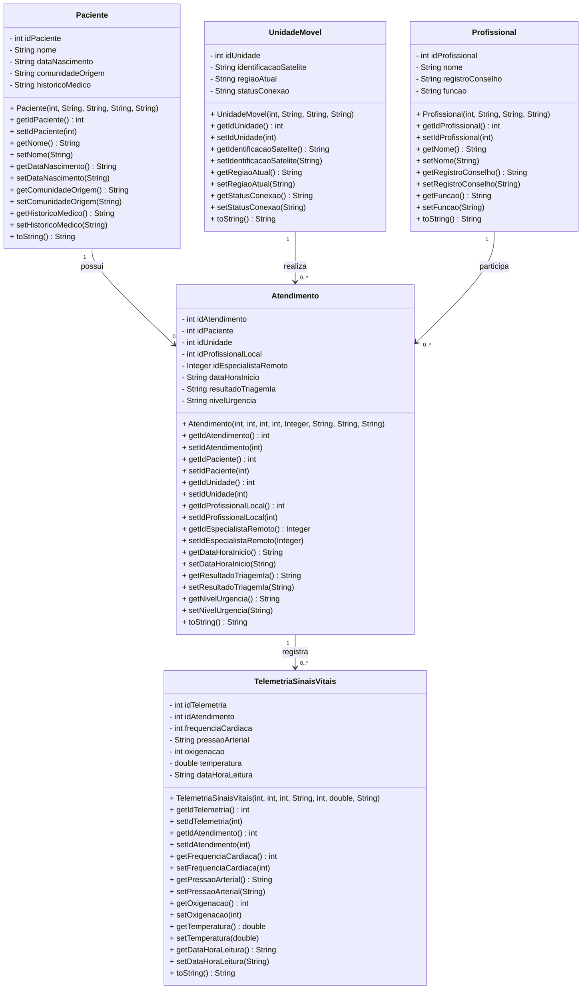

# Sistema de Atendimento em Unidades Móveis de Saúde

Projeto Java desenvolvido para simular um sistema de atendimento em saúde utilizando Programação Orientada a Objetos.

## Funcionalidades

Cadastro, listagem, busca e atualização de pacientes.

Cadastro e listagem de unidades móveis.

Cadastro e listagem de profissionais de saúde.

Registro e listagem de atendimentos.

Registro e listagem de sinais vitais.

## Diagrama UML de Classes



## Organização do Projeto

```text
src
  Main.java
  model
    Atendimento.java
    Paciente.java
    Profissional.java
    TelemetriaSinaisVitais.java
    UnidadeMovel.java
```
